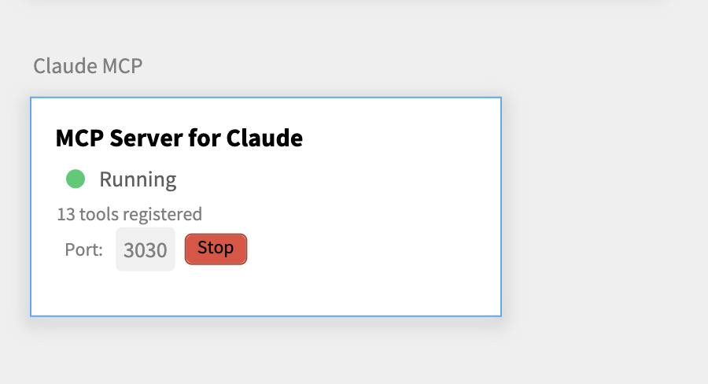
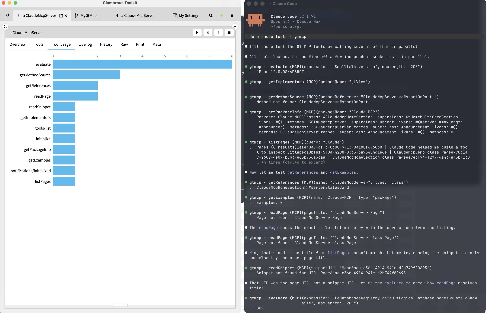

# MyGtMcp

A [Glamorous Toolkit](https://gtoolkit.com/) MCP server for [Claude Code](https://docs.anthropic.com/en/docs/agents-and-tools/claude-code/overview). Exposes GT tools (evaluate, getMethodSource, getReferences, listPages, etc.) over MCP so Claude Code can interact with your live GT image.

## Screenshots

### MCP Server Status in GT



### Claude Code Smoke Test



## Installation

```st
Metacello new
	repository: 'github://dweinstein/mygtmcp/src';
	baseline: 'MyGtMcp';
	load
```

## Load Lepiter

After installing with Metacello, you will be able to execute

```st
#BaselineOfMyGtMcp asClass loadLepiter
```

## Add to Claude Code

```
claude mcp add --transport http gtmcp http://localhost:3030
```

## Warning

This launches an MCP server on a port and gives arbitrary code execution like evaluate to whoever is using it, without any authorization or authentication.
